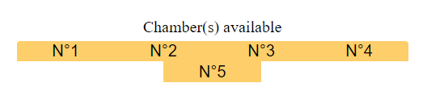
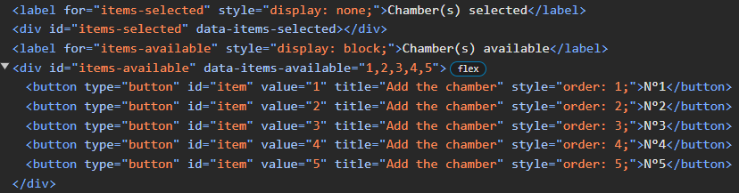
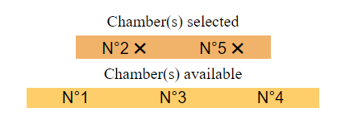
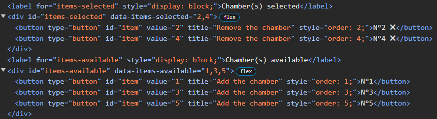
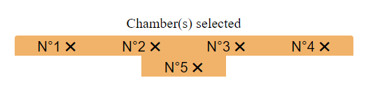
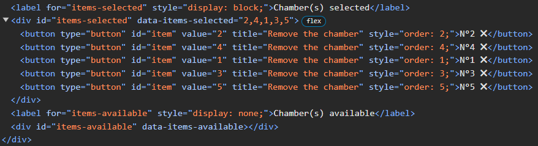

# Custom Multi-Select JavaScript Component

In the HTML page  :
             
        <link rel="stylesheet" href="multi-select.css">
        

            <label for="items-selected" style="display: none;">Chamber(s) selected</label>
            

            <label for="items-available">Chamber(s) available</label>
            

        

        
        

## Preview

